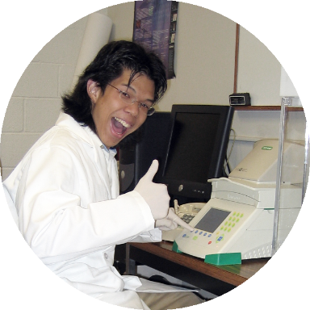

# [atet](https://github.com/atet) / [**_profile_mit_**](https://github.com/atet/profile_mit/blob/main/README.md#atet--profile_mit)

# [Athit Kao, PhD](https://www.athitkao.com)

[Massachusetts Institute of Technology's Lincoln Laboratory Beaver Works Summer Institute](https://beaverworks.ll.mit.edu/CMS/bw/) for high school students.

The following is content for my invited talk representing [RTX (formerly Raytheon Technologies)](https://www.rtx.com/).

--------------------------------------------------------------------------------------------------

## **Abstract: STEAM in the Age of AI**

In his thought-provoking and engaging talk, Dr. Athit Kao will take a quick dive into his multidisciplinary career and share valuable insight and lessons learned along his journey. Addressed to high schoolers continuing into college during the emergence of artificial basic intelligence, this discussion will not only inspire the students, but also empower them to take control and navigate their own way forward.

Dr. Kao will first describe his career path, focusing on the pivotal roles that led to his current position. This will highlight how critical being proactive, adapting to change, and maintaining curiosity are to overcoming challenges that may seem insurmountable at first, but will lead to unexpected opportunity later.

The second part will overview three exciting programs from Dr. Kao’s company, fascinating the students with the good they bring or will bring to the world. These three projects represent how different domains collaborate towards an interdisciplinary synergy to face seemingly-impossible accomplishments.

Lastly, he will distill his lessons-learned in context of personal stories from his academic and professional experiences. By providing inspiring insights and unfettered enthusiasm, Dr. Kao seeks to bolster the confidence of the students to succeed in the age of unprecedented machine intelligence.

—

## ***About the Speaker***

Dr. Athit Kao takes his expertise from the sciences into the business world of engineering, motivating others to also break down the artificial barriers of their traditional career paths along the way. This scientist-turned-[*intrapreneur*](https://hbr.org/2020/03/why-you-should-become-an-intrapreneur) serves as a recognized leader in his academic and professional communities, advocating exactly how fascinating and fulfilling a multidisciplinary STEAM journey can be.

Dr. Kao’s interests in science began during his childhood, watching television shows like Bill Nye the Science Guy and *NOVA* on PBS. As he approached high school graduation, the twists and turns of those thirteen years gave him the opportunity to explore every corner of a STEAM education. From biology and computer science to JROTC leadership and home economics, he was prepared to grow his technical and intrapersonal skills in the emerging field of bioinformatics.

Through his undergraduate and graduate studies in biotechnology and his professional scientific roles in industry, Dr. Kao always felt like there was something more to be done. In a sudden career pivot into entrepreneurship, he led a team of fellow scientists into the software engineering field, securing seed funding and incubator support. He has been quoted to say, “*This has been a major turning point in my career,*” in which those experiences led to him being recruited by Raytheon Technologies, the world’s largest aerospace and defense company.

Dr. Athit Kao currently leads innovation, outreach, and data science at Raytheon Blackbird Technologies, a special operations-focused subsidiary. Dr. Kao can be seen volunteering and mentoring around the country, sharpening his technical expertise and learning new things in the laboratory, or improving his intrapersonal and leadership skills with his coaches and mentors. He lives in San Diego, California with his scientist wife and enjoys international travel to see the wonders of our world.

    

> Athit Kao as an undergraduate student researcher in Dr. Judith Wubah's molecular biology lab at [James Madison University](https://www.jmu.edu/biology/index.shtml).

--------------------------------------------------------------------------------------------------

[Back to Top](#table-of-contents)

--------------------------------------------------------------------------------------------------

Copyright © 2023-∞ Athit Kao, <a href="http://www.athitkao.com/tos.html" target="_blank">Terms and Conditions</a>
