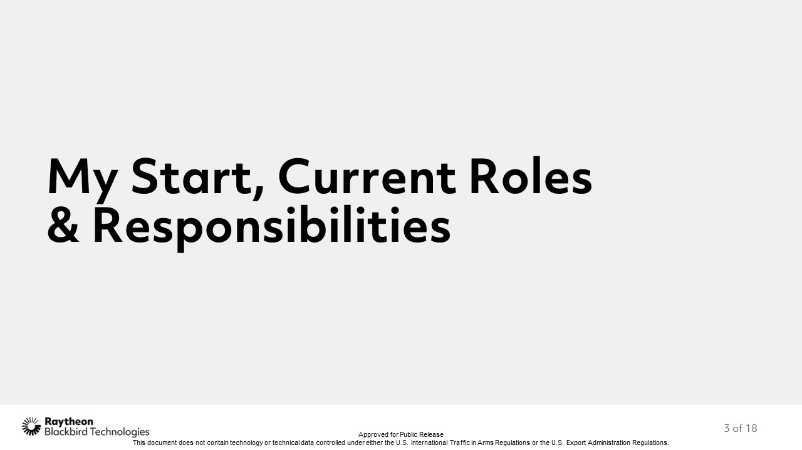
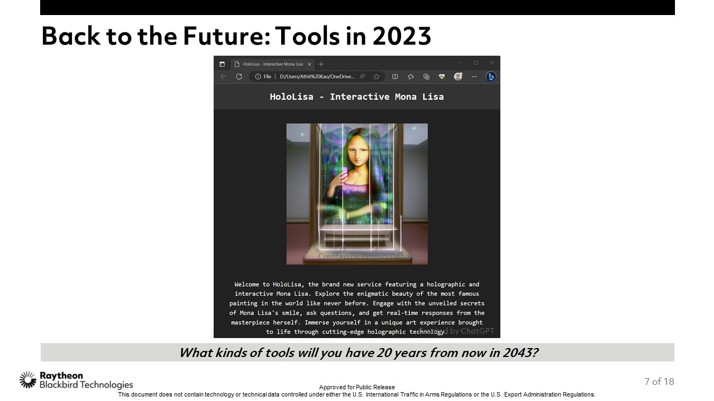
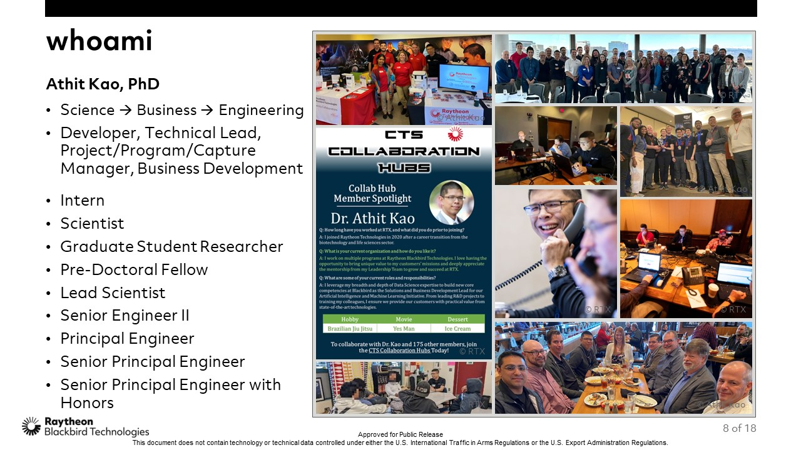

# [atet](https://github.com/atet) / [**_profile_mit_**](https://github.com/atet/profile_mit/blob/main/README.md#atet--profile_mit)

# [Athit Kao, PhD](https://www.athitkao.com)

Content for Dr. Athit Kao's invited talk at MIT representing [RTX (formerly Raytheon Technologies)](https://www.rtx.com/).

--------------------------------------------------------------------------------------------------

## Abstract: **STEAM in the Age of AI**

In his thought-provoking discussion with MIT's Beaver Works Summer Institute, Dr. Athit Kao will share insights from his multidisciplinary journey across science, engineering, and business. Addressed to high school students continuing into higher education, his stories will empower them to navigate their own way forward alongside the emergence of practical artificial intelligence.

Dr. Kao will first describe his career path; focusing on the pivotal roles that led to his latest position at RTX, such as leading teams and major initiatives despite his introverted personality. This will highlight how being proactive and adaptive to change is critical in transforming seemingly insurmountable challenges into unexpected opportunities.

The second part will overview exciting projects from Dr. Kao’s company in the domains of meteorology, communications, and conservation. Three specific endeavors are discussed that represent how interdisciplinary collaboration is absolutely necessary to push the boundaries of technology into the next generation.

Lastly, he will distill his lessons-learned in context of anecdotes from his academic and professional experiences. From his first-hand stories, Dr. Kao seeks to inspire newfound confidence and motivate the students to set visionary goals in this current age of unprecedented technology.

—

### ***About the Speaker***

    

> Undergraduate Student Researcher Athit Kao performing genomics research in Dr. Judith Wubah's lab at [James Madison University](https://www.jmu.edu/biology/index.shtml), Summer Semester 2005.

Dr. Athit Kao takes his expertise from the sciences into the business world of engineering, helping others break down the artificial barriers of their traditional career paths along the way. This scientist-turned-[*intrapreneur*](https://hbr.org/2020/03/why-you-should-become-an-intrapreneur) serves as a recognized leader in his academic and professional communities, advocating exactly how fascinating and fulfilling a multidisciplinary STEAM journey can be.

Dr. Kao’s interests in science began in his early childhood, learning from television shows like Bill Nye the Science Guy and *NOVA* on PBS. As he approached high school graduation, the twists and turns of public schooling gave him the opportunity to explore every corner of a STEAM education. From biology and computer science to JROTC leadership and home economics, he was prepared to grow his skill sets in the burgeoning field of biotechnology.

Through his undergraduate studies, graduate fellowship, and professional roles in bioinformatics, Dr. Kao always felt there were other profound ways he could contribute to the community. In a sudden career pivot, he led a team of fellow scientists into the software industry, securing seed funding and startup incubator support. Unbeknownst to him at the time, this would be a major turning point in his life. Those specific entrepreneurial experiences would secure his recruitment to guide business development efforts at Raytheon Technologies, the world’s largest aerospace and defense company.

Dr. Athit Kao currently leads innovation, outreach, and a federal government program at Raytheon Blackbird Technologies, a special operations-focused subsidiary. Dr. Kao can be found volunteering across the country, sharpening his technical expertise for competitions, and improving his intrapersonal skills with his mentors and mentees. He lives in San Diego, California with his scientist wife and enjoys international travel to see the wonders of our world.

[Back to Top](#table-of-contents)

--------------------------------------------------------------------------------------------------

## Slide Show

- This is an animated `*.gif` that is approximately 4 minutes long
- Click through for individual slides (18 total)

[Back to Top](#table-of-contents)

--------------------------------------------------------------------------------------------------

## Bonus Content: **Questions for the Speaker**

 

    

 

1. How did your multidisciplinary background shape your perspective on problem-solving, innovation, and decision-making across various fields? 
 
<i>My multidisciplinary background was absolutely critical in my career advancement:</i> 
<i>• Problem Solving: When you only have a hammer, everything looks like a nail. Having a breadth of knowledge gives you options.</i> 
<i>• Innovation: Borrowing from the cybersecurity field a fitting example. When you only have engineers design the defense, they will think to only defend against other engineers.</i> 
<i>• Decision Making: My twist is that it's fun to work in teams. Being able to communicate across disciplines makes it easier to get other people involved to ensure the best decisions are made collaboratively.</i> 
 
— 
 
2. Can you share an example of a time when your scientific expertise helped you approach a business challenge creatively and vice versa? 
 
<i>We had a tough customer decision to pursue a technology requiring additional contract funding. Leveraging my technical and business communications experience, I collaborated with my business leadership to fund the development of an internal prototype that derisked our customer's decision. This led to contract growth in the following year to specifically build this capability. I didn't think of this as just working on a cool idea, but also considered how that helped both organizations' bottom line; a win-win to increase efficiencies on both sides.</i> 
 
— 
 
3. As a high achiever yourself, how do you maintain a healthy work-life balance while pursuing excellence in multiple domains? 
 
<i>In my experience, burnout results from doing a lot of similar things in a packed schedule. If you have multiple skill sets, doing a lot of different things in that same schedule allows you to spread your focus to multiple interests. This will prevent burnout and allow you to sustain long periods of moving forward in your personal and professional development.</i> 
 
— 
 
4. How has your experience as an entrepreneur influenced your approach to scientific research and engineering projects? 
 
<i>Though I imagine a more futuristic world as an entrepreneur, I had always been more on the practical side of things (a.k.a. "Connector" from the <a href="https://www.innovating.com/post/the-nostradamus-approach-make-the-invisible-visible-to-forecast-innovation">Innovation Strengths Preference Indicator®</a>). I wanted to make sure the work I did in research could be readily translated into immediate value. Given this, my entrepreneurial spirit routinely pitches ideas, negotiates, executes, and provides actionable insights to effectively move my efforts forward.</i> 
 
— 
 
5. What do you consider the most significant ethical dilemma you've encountered in your career, and how did you navigate it? 
 
<i>At the final interviews for a Business Analytics Manager role, they directly asked me how I would handle reporting on metrics that didn't align with company forecasts. I took that as a big red flag and did not continue to pursue that company any further.</i> 
 
— 
 
6. In your opinion, what are the most pressing scientific or technological challenges society needs to address, and how can multidisciplinary professionals contribute to solving them effectively? 
 
<i>Data privacy. We forget that even with all the legislation protecting the personally identifiable information that we freely give out, it's not going to stop that next data breach from turning our lives upside down. Efforts are underway to professionalize cybersecurity so that anyone from any discipline can know where to start and join the good fight.</i> 
 
— 
 
7. Can you elaborate on a time when you faced resistance or skepticism due to your diverse background, and how did you overcome it? 
 
<i>When I first started getting into business and engineering, I realized not many people really know what scientists do. I relied on my interdisciplinary communications experience to translate my skills and accomplishments, appealing to a variety of audiences. This ensured that non-scientist stakeholders knew exactly how I was going to work with them and how I would transform my demonstrated value to benefit their organizations.</i> 
 
— 
 
8. What strategies do you employ to stay continually updated in all the fields you partake in, considering the rapid pace of scientific and technological advancements? 
 
<i>Two pieces of advice:</i> 
<i>• How to keep up: Focus your energy on a platform that will provide timely updates on your curated professional interests and allows networking with like-mined people, e.g. LinkedIn ("the social media platform for the U.S. government, period!" - A former high-ranking U.S. government employee).</i> 
<i>• How NOT to keep up: Making yourself feel bad that you're not at the cutting edge. Things are moving faster now than ever, no one is ever "caught up". Do the best you can for the topics that bring you immediate value; <b>prioritize</b>.</i> 
 
— 
 
9. Looking back, is there anything you would have done differently during your education or early career to better prepare for your multidisciplinary journey? 
 
<i>Taking Bitcoin more seriously in 2009...just kidding. It's important to enjoy the present. Don't look back too much unless it's for something that will motivate you to do better right now.</i> 
 
— 
 
10. How do you see the integration of various disciplines evolving in the future, and what impact might it have on the way we approach and solve complex problems?
 
 
<i>With the advent of practical machine learning approaches, <b>everyone</b> would benefit from learning how to synergize their expertise with this technology. Doesn't matter what field you come from; these tools can provide real value ranging from being more efficient to unlocking your creativity. As most great achievements are team efforts, having every single member more effective will make complex problems even more manageable.</i> 
 
— 

[Back to Top](#table-of-contents)

--------------------------------------------------------------------------------------------------

## Supplemental: Individual Slides

[Back to Top](#table-of-contents)

--------------------------------------------------------------------------------------------------

## Disclaimer

***Presentation slides and script were created with 100% original human content by [Athit Kao, PhD](http://www.athitkao.com). See figures for individual attribution.***

***Abstract and Speaker Biography were created with 99% human content, guided by a template that appeals to high school students proposed by [ChatGPT (OpenAI, 2023)](https://chat.openai.com/chat).***

***Bonus Content questions were generated by ChatGPT and answers were created with 100% original human content by [Athit Kao, PhD](http://www.athitkao.com).***

[Back to Top](#table-of-contents)

--------------------------------------------------------------------------------------------------

Copyright © 2023-∞ Athit Kao, <a href="http://www.athitkao.com/tos.html" target="_blank">Terms and Conditions</a>
